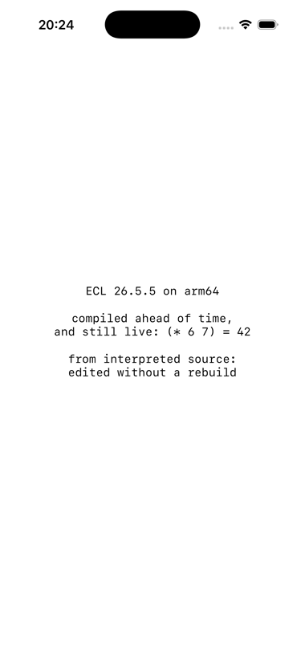
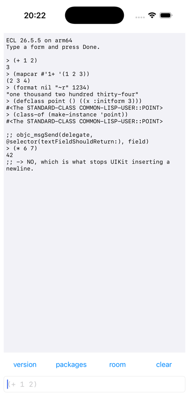
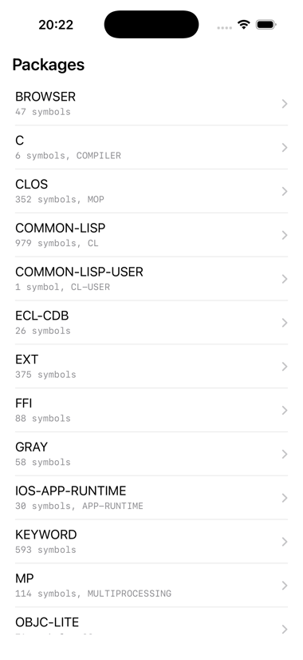
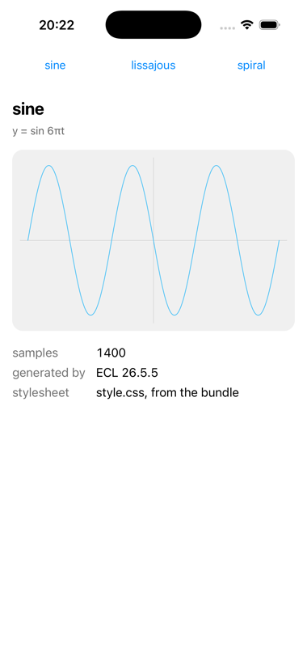
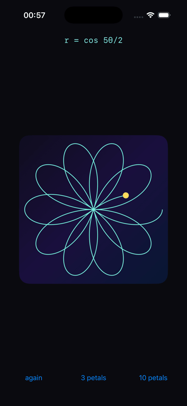
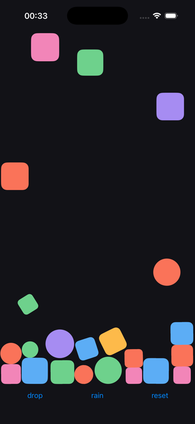
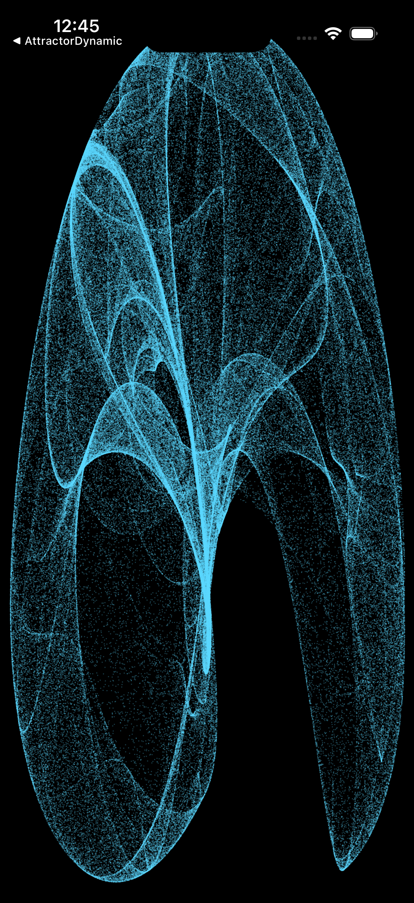
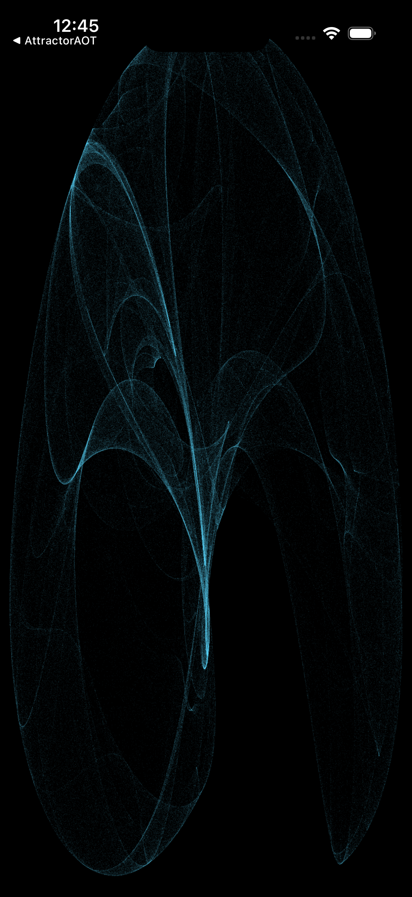
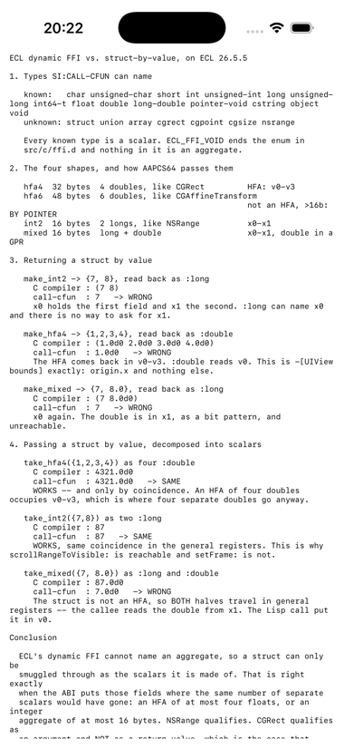
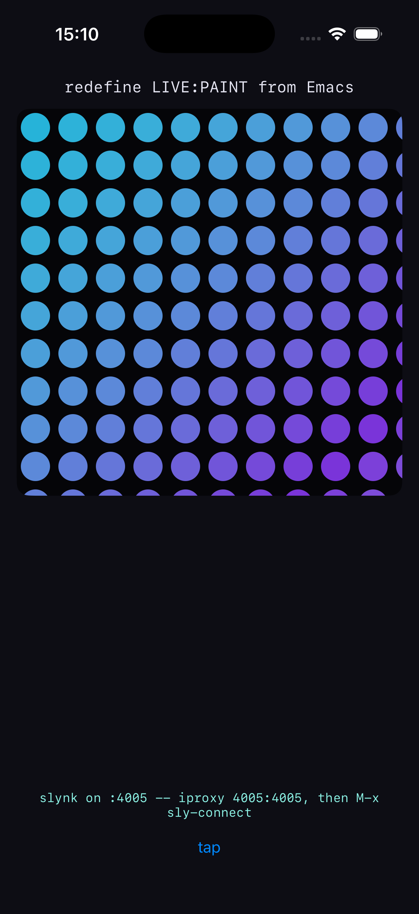

# asdf-ios-app

An ASDF extension that builds an iOS `.app` bundle from an ECL image. No Xcode
project, no `xcodebuild`: the operation drives `clang`, assembles the bundle and
signs it.

```lisp
(defsystem "attractor"
  :defsystem-depends-on ("asdf-ios-app")
  :class :ios-app-system
  :build-operation "ios-app-op"
  :entry-point "attractor:start"
  :version "1.0.0"
  :bundle-identifier "com.example.attractor"
  :bundle-name "Attractor"
  :bundle-platforms (:simulator :device)
  :depends-on ("alexandria")
  :components ((:file "attractor")))
```

```
$ ecl --eval '(asdf:make "attractor")' --eval '(quit)'
; cross-compiling attractor for iphonesimulator
; built /path/to/build/iphonesimulator/Attractor.app/
```

Your Lisp is cross-compiled to native arm64 and linked in. It is *not* frozen by
that: `defun`, `defclass` and `defmethod` all work at run time, because the boot
installs the bytecodes compiler.

`examples/attractor-aot/` is a `UIView` whose `drawRect:` is a Lisp function,
drawing 300,000 points of a de Jong attractor; `examples/attractor-dynamic/`
is the same figure with no C in the app at all. `examples/hello/` is the least
you can write. There are more below.

## The examples

<table>
<tr>
  <th align="center">hello</th>
  <th align="center">repl</th>
  <th align="center">browser</th>
</tr>
<tr>
  <td></td>
  <td></td>
  <td></td>
</tr>
<tr>
  <th align="center">chart</th>
  <th align="center">layers</th>
  <th align="center">physics</th>
</tr>
<tr>
  <td></td>
  <td></td>
  <td></td>
</tr>
<tr>
  <th align="center">attractor-aot</th>
  <th align="center">attractor-dynamic</th>
  <th align="center">abi-probe</th>
</tr>
<tr>
  <td></td>
  <td></td>
  <td></td>
</tr>
<tr>
  <th align="center">live</th>
  <th></th>
  <th></th>
</tr>
<tr>
  <td></td>
  <td></td>
  <td></td>
</tr>
</table>

Every one of these is a screenshot of the simulator, from a clean install of a
build made by `asdf:make` — there is no Xcode project anywhere in the
repository. Five of them are written against
[objc](https://github.com/lispnik/objc), the LispWorks-compatible Objective-C
interface, and its `objc/uikit` conveniences — see below.

| | what it is | what it shows |
|---|---|---|
| `hello` | a label | the least that builds |
| `repl` | a REPL with a keyboard | a `UITextFieldDelegate` written in Lisp, and `keyboardLayoutGuide` instead of a `CGRect` |
| `browser` | the running image, as a table | a `UITableViewDataSource` written in Lisp — packages, symbols, and what a symbol is |
| `chart` | SVG in a `WKWebView` | a framework beyond UIKit, a bundled resource, and state that survives a relaunch |
| `layers` | a rose curve drawing itself | Core Animation — a `CGPath` computed in Lisp, stroked by a `CAShapeLayer`, with a dot riding the tip |
| `physics` | shapes falling into a heap | UIKit Dynamics — gravity, collision, elasticity and rotation; a `CGRect` in and a `CGPoint` out, by value, with no C |
| `attractor-aot` | a strange attractor you can drag | `drawRect:` in Lisp, gestures, a C trampoline compiled ahead of time and kept on purpose, and redefining the mathematics over SLY |
| `attractor-dynamic` | the same attractor, with no C at all | `drawRect:` as a Lisp method taking its `CGRect` by value, the frame rendered into a Lisp array and shown as one `CGImage`, and the gestures reaching closures |
| `live` | a canvas, a caption and a button | programming the phone from Emacs over the USB cable: SLY connected to the app on a device, and every function on the screen redefined without a rebuild — see [`examples/live/`](examples/live/) and its `tour.lisp` |
| `abi-probe` | a report, not an interface | exactly which structs `si:call-cfun` can carry, measured |
| `closure-probe` | a report, not an interface | what ECL's dynamic FFI can do on a phone, measured on an iPhone 16e: a libffi closure, a `CGRect` in and an `NSRange` out through one, and a variadic call |

Build any of them with `asdf:make`, with `examples/` on your source registry:

```lisp
(asdf:make "browser")
(ios-app:run-in-simulator "browser")
```

**All but one need no C compiler at build time and no `:bundle-trampolines`.**
A message send is `objc:invoke`, a class whose methods are Lisp is
`objc:define-objc-class`, and structures go by value in both directions — a
`UITableViewDataSource`, a `CGRect` to `-initWithFrame:`, a `CGPoint` back
from `-locationInView:` — all through ECL's dynamic FFI, on the phone, with
nothing compiled by a C compiler. That takes the ECL that `bootstrap-ecl`
builds; see [The ECL it builds](#the-ecl-it-builds).

`attractor-aot` is the one that keeps a trampoline file, and it keeps it by
choice rather than necessity: its `drawRect:` calls CoreGraphics two million
times a frame, which is a reasonable thing to have in C. `attractor-dynamic` is
the same figure without it, and shows the other way to do a hot loop: not two million
foreign calls from Lisp, but the frame rendered into a Lisp array and handed
to CoreGraphics as one image. The two are meant to be read side by side.

### `objc` and `objc/uikit`

The examples take [objc](https://github.com/lispnik/objc) as a dependency:
put its directory and its `ocicl/` tree on your source registry beside
`examples/`. `objc` is the whole LispWorks Objective-C interface — `invoke`,
`define-objc-class`, `define-objc-method`, blocks from Lisp closures — and it
runs on ECL on a phone exactly as it does on a Mac.

`objc/uikit` is the dozen things every UIKit screen does, as a package
`UIKIT`: a view with autoresizing translation off, a system button, the root
view, colours and fonts, anchors pinned and fixed, and a Lisp function behind
a control, a gesture recognizer or a timer.

```lisp
(objc:invoke label "setText:" "hello")
(ui:pin label "centerXAnchor" view "centerXAnchor")
(ui:on-tap (ui:system-button "again") (lambda (sender) (restart-animations)))

(objc:define-objc-method ("tableView:numberOfRowsInSection:" (:signed :long-long))
    ((self table-source) (table objc:objc-object-pointer) (section (:signed :long-long)))
  (length (rows)))
```

It works **compiled and interpreted alike**, so an interface can be built a
form at a time at a remote REPL; and because the dynamic FFI now carries a
structure, `-bounds`, `-frame` and `-setFrame:` are ordinary sends.

There used to be an `objc-lite` here — three hundred lines of `si:call-cfun`
over `objc_msgSend`, with the rule that no message may take or return a
struct by value, because ECL's foreign type table could not name one. That
rule came from the ECL of the time and not from the platform, and once the
table was opened there was no reason to keep a second, smaller bridge. `hello`
still open-codes the six lines it needs, so that the minimal example stays
minimal.

## Getting a toolchain

An iOS build needs an ECL cross-built for the target, and a *host* ECL from the
same source tree. One command produces all of it:

```lisp
(asdf-ios-app:bootstrap-ecl)                        ; clone, patch, build
(asdf-ios-app:bootstrap-ecl :source #p"~/src/ecl/") ; use a tree you have
```

About ten minutes from nothing. It records what it built in
`~/.cache/asdf-ios-app/toolchain.sexp`, so nothing needs configuring afterwards,
and re-running rebuilds nothing. `tools/build-ecl-ios.sh` is the same recipe as a
shell script, for when you would rather not run a Lisp to get a Lisp.

**The host ECL is not a convenience.** The cross build reuses its `dpp` and
`ecl_min`, and `dpp` resolves each `@[pkg::sym]` in ECL's C sources to a numeric
*index* into `symbols_list.h` — so a host ECL from another revision does not
fail, it silently resolves every symbol to the wrong index. `bootstrap-ecl`
builds a matched set and `check-ecl-prefix` refuses a mismatch.

### The ECL it builds

`bootstrap-ecl` clones [lispnik/ecl](https://github.com/lispnik/ecl) at
`develop` — upstream `develop` plus fixes that are not upstream yet, each also
on its own branch there for sending on:

1. `ecl_library_symbol` calls `dlsym(0, symbol)` for the `:default` module. On
   Darwin a null handle is not the global scope — `RTLD_DEFAULT` is
   `(void *)-2` — so it always returned NULL, and CFFI, whose ECL backend
   resolves foreign functions by name, could not work at all.
2. `ffi:callback` returned a libffi closure's writable record rather than its
   entry point. The two coincide only where memory may be both; on iOS and
   arm64 macOS they are mapped apart, and calling the record jumped into the
   heap. `examples/closure-probe/` measures this on a phone.
3. `si:call-cfun` passes and returns structures by value, so a `CGRect` no
   longer has to be smuggled through as scalars and hoped about.

One more is a build matter rather than a patch: `configure.ac` ties
`ENABLE_DLOPEN` to `--enable-shared`, and an iOS app must link statically while
still being able to `dlsym`, so the cross build defines it anyway. That one is
detectable from a built prefix and is checked.

`tools/patches/` still holds the `RTLD_DEFAULT` change as a patch, applied
only if the tree lacks it, so a build from upstream `develop` works too.

## Three decisions that shape the design

**There is no image dump.** ECL has no `save-lisp-and-die`, and iOS would not run
the result. The system is cross-compiled to a static library and linked with
`libecl.a`, so the linker *is* the install step — there is no core, and no
symlink reconciling a runtime with it.

**A callback must be compiled, not allocated.** `si::make-dynamic-callback` — the
libffi-closure path behind `ffi:defcallback` — *kills the process* on iOS,
silently and uncatchably, because `ffi_closure_alloc` needs
writable-then-executable memory. Compiled ahead of time with `ffi::*use-dffi*`
bound to `NIL`, `defcallback` emits an ordinary C function instead. That is why
the whole design is ahead-of-time.

**A simulator build is signed with no entitlements at all.** iOS validates a
binary's entitlements against its provisioning profile, and a simulator app has
none — so an ad-hoc signature carrying `get-task-allow` is refused at launch:

```
The request to open "org.example.app" failed.
The request was denied by service delegate (SBMainWorkspace).
```

which says nothing about entitlements and sends you to `Info.plist`. An
Xcode-built simulator app carries none either. Device builds get theirs *from*
the profile, which is the only authority on what they may be.

## Layout produced

An iOS bundle is flat. There is no `Contents/`.

```
build/iphonesimulator/Attractor.app/
  attractor                  the linked executable
  Info.plist   PkgInfo   _CodeSignature/
  embedded.mobileprovision   device builds only
  lisp/                      only with :bundle-interpreted
  <resources at the top level>
```

Which means a resource called `Info.plist` does not land somewhere harmless — it
lands on the `Info.plist`. Reserved names are refused.

## Options

| Option | Default | |
| --- | --- | --- |
| `:bundle-identifier` | — | **required** |
| `:bundle-name` | capitalised system name | `CFBundleName`, and the `.app` name |
| `:bundle-executable` | downcased system name | |
| `:bundle-display-name` | bundle name | |
| `:bundle-short-version` | `:version` | |
| `:bundle-platforms` | `(:simulator)` | any of `:simulator` `:device` |
| `:bundle-minimum-os-version` | `"15.0"` | `MinimumOSVersion`, *not* `LSMinimumSystemVersion` |
| `:bundle-device-family` | `(:iphone :ipad)` | |
| `:bundle-orientations` | `(:portrait)` | |
| `:bundle-ipad-orientations` | — | written only if given |
| `:bundle-launch-screen` | `t` | an empty `UILaunchScreen`; without it iOS letterboxes the app |
| `:bundle-required-capabilities` | `("arm64")` | |
| `:bundle-status-bar-hidden` | `nil` | |
| `:bundle-url-schemes`, `:bundle-document-types`, `:bundle-category`, `:bundle-copyright` | — | |
| `:bundle-info-plist` | — | alist merged over the generated plist |
| `:bundle-resources` | — | paths, or `(path . "destination")` |
| `:bundle-interpreted` | — | systems shipped as source; see below |
| `:bundle-trampolines` | — | files compiled for the target only; see below |
| `:bundle-ecl-modules` | — | e.g. `("sockets")`; `asdf` is added when needed |
| `:bundle-frameworks` | `("UIKit" "Foundation" "CoreGraphics")` | |
| `:bundle-static-libraries`, `:bundle-link-flags`, `:bundle-objc-flags` | — | |
| `:bundle-objc-sources` | — | your own `.m`, compiled after ours |
| `:bundle-objc-main` | — | replaces `ECLMain.m` |
| `:bundle-app-delegate` | `"ECLAppDelegate"` | |
| `:bundle-output-directory` | `<system>/build/` | |
| `:bundle-icon` | — | a `.xcassets` directory, compiled by `actool` |
| `:remote-repl` | `nil` | `t`, a port, or a plist; see below |
| `:code-signing-identity` | `:automatic` | ad hoc on simulator; required on device |
| `:development-team`, `:provisioning-profile` | — | device |
| `:entitlements` | `:ios-default` | none on simulator, from the profile on device |
| `:get-task-allow` | `t` | lets a debugger attach; a distribution build must not |

`:entry-point` is stock ASDF, and **means something different here**. It is not a
toplevel that runs to completion: it is called once, on the main thread, from
`-application:didFinishLaunchingWithOptions:`, and it must *return* so the run
loop can start.

## Ahead of time does not mean frozen

This is the point most likely to be got wrong. Compiling ahead of time is about
how code *ships*, not whether the image is alive. On the device, with a fully
compiled system:

- `defun`, `defvar`, `defclass`, `defmethod` at run time all work — the boot
  installs the bytecodes compiler, so `COMPILE` produces bytecode rather than
  failing.
- **Redefining a compiled function works.** The new definition is bytecode and
  replaces the `fdefinition`; the native one is simply no longer called.
- UIKit can be driven from Lisp: `objc_msgSend` through `si:call-cfun` needs no
  compiler.

What ahead-of-time buys, and nothing else can: native speed, and
`ffi:defcallback`.

`:bundle-interpreted` names systems to ship as *source*, loaded at boot from a
manifest that carries dependency order into an image with no ASDF. The intended
shape is a compiled core with an editable skin:

```lisp
:depends-on ("my-app-scripts")
:bundle-interpreted ("my-app-scripts")
```

Edit a file in `MyApp.app/lisp/`, reinstall, and the behaviour changes with no
compiler, no relink and no re-sign.

One caution: compiled modules are initialised *before* any bundled source is
loaded, so compiled code must not touch an interpreted package at **load** time.
A reference deferred to run time is fine, and is what `examples/hello` does. The
build says so when the shape arises; it cannot decide it for you.

## Trampolines, and the ABI

`ffi:c-inline` is normally useless on iOS because it needs a C compiler. Cross
compiling means there *is* one, at build time — and then the C compiler
implements the ABI, so the things ECL's dynamic FFI cannot express come free:

```lisp
;; NSRange, returned BY VALUE
(range-of-string haystack needle)  ; => (6 . 5)
;; CGRect, a 32-byte homogeneous float aggregate in v0-v3
(cgrect-inset-area 0d0 0d0 10d0 10d0)  ; => 48.0d0
```

Files named by `:bundle-trampolines` are compiled **for the target only, never
on the host**. That exemption is the whole feature. Ordinary sources are
compiled twice — natively in the child, so the cross compiler has their macros,
and then for iOS — and `c-inline` survives neither half: it cannot be
interpreted, and compiling it natively makes ECL build and *link* a host fasl,
which fails the moment the C mentions CoreGraphics or `objc_msgSend`.

### Why a trampoline, and not just more `si:call-cfun`

Less reason than there was. ECL's foreign type table (`src/c/ffi.d`,
`ecl_foreign_type_table`) was a closed enum of scalars ending at
`ECL_FFI_VOID`, with no struct, union or array member and no way to add one, so
`si:call-cfun` had no way to *say* `CGRect`. The ECL that `bootstrap-ecl` now
builds takes `(:struct …)` designators and lets libffi classify them, and a
`CGRect` goes by value in either direction with nothing compiled. What still
needs `c-inline` is C that is not a call — a `drawRect:` body, a
`CGContextRef` — and a variadic send.

The workaround the old table forced was to decompose the struct into the
scalars it is made of. `examples/abi-probe/` measures when that is right,
against ground truth produced by the C compiler in the same binary calling the
same functions, and the answer is why it was never safe to keep. On
arm64:

| | as an argument | as a return value |
|---|---|---|
| `NSRange` — 2 ints, 16 bytes | works (`x0`, `x1`) | **only the first field** |
| `CGRect` — 4 doubles, an HFA | works (`v0`–`v3`) | **only `origin.x`** |
| `long` + `double`, 16 bytes | **wrong** — both halves go in general registers, so the `double` is expected in `x1` | **only the first field** |
| `CGAffineTransform` — 6 doubles | **wrong**: not an HFA and over 16 bytes, so it is passed *by pointer* | **wrong** |

So decomposition works exactly when AAPCS64 happens to put the fields where
that many separate scalars would have gone, and never on the way back — which
is the direction that matters, because `-bounds` and `-frame` are how you ask a
view anything.

**None of the failures is a Lisp error.** They are wrong numbers. The two
indirect cases are worse than wrong: the callee reads 48 bytes through a
register the caller never set, and for the return value *writes* 48 bytes
through one. Neither faulted when measured, which is luck rather than safety —
and the value read back changed between launches of the same binary
(`-48200.0d0`, then `2.32e-318`). There is no handler to write and nothing to
test for at run time.

```
$ xcrun simctl launch <device> org.asdf-ios-app.abi-probe
$ SIMCTL_CHILD_ABI_PROBE_CASE=take_hfa6 xcrun simctl launch <device> org.asdf-ios-app.abi-probe
```

The report is written to the app's `Documents/abi-report.txt` and shown on
screen. Each indirect case gets its own launch, and every line is flushed, so a
process that does fault still leaves its evidence.

### Three things to know when writing one

- **The C must be plain C, not Objective-C.** A trampoline is a cast of
  `objc_msgSend` to one concrete prototype, which is C anyway.
- **No `@` may appear in a `c-inline` body**, because ECL reads it as the start
  of its own `@(return)` syntax. That rules out `@"literals"` *and* Objective-C
  type encodings; pass an encoding in as a `:cstring` argument instead.
- **Declare the package in an ordinary component.** A trampoline file's
  `defpackage` never runs on the host, and ordinary sources — which are read
  there — cannot then read a symbol in it.

## A REPL on the phone

```lisp
:depends-on ("slynk")
:remote-repl t                      ; or 9999, or (:port 4005 :interface nil)
```

That starts a slynk server at boot -- **before** the entry point, because an entry point that signals is
exactly when you most want a way in, and a REPL that came up afterwards would
leave you rebuilding to find out why.

Slynk anywhere in the closure links `sockets`, `sb-bsd-sockets` and `cmp`,
whether or not `:remote-repl` is on: slynk loads either way, and its
`(require 'sockets)` with no linked module is an error inside module
initialisation, where nothing catches it. A module that fails to initialise
ends the app with an uncaught `ECLBootModuleInitFailed` exception whose reason
names the module and the condition -- in the crash report and on the console --
rather than a bare segmentation fault in `ecl_unwind`, which is what it was.

Slynk is not a dependency of this extension: which REPL server you want is
yours to say. It is also not on Quicklisp under that name, so put sly's
`slynk/` directory on your source registry. A `:remote-repl` build whose
closure has no slynk in it is refused at build time rather than at boot.

Connecting: the simulator shares the Mac's loopback, so `M-x sly-connect` to
`localhost 4005` just works. A device needs a forwarder --
`brew install libimobiledevice`, then `iproxy 4005:4005` -- and
[`examples/live/`](examples/live/) is built around exactly that: its
`iphone.el` is one Emacs command that starts the forwarder and connects, and
its `tour.lisp` is ten forms to send to the phone. Measured on an iPhone 16e:
the server is up before the entry point, the entry point runs, and SLY gets
its `connection-info` through the cable.

### Everything that touches UIKit goes through `on-main`

Slynk evaluates on its own worker thread and UIKit is main-thread only, so this
is not a style preference -- a view built from the REPL thread is undefined
behaviour that usually looks like it worked.

```lisp
(ios-app-runtime:with-main-thread
  (make-a-view))
```

`with-main-thread` (and `on-main`, which takes a thunk) dispatches to the main
queue, waits, returns every value, and re-signals a condition on the thread
that asked -- so an error still lands in your debugger rather than on a thread
nobody is watching. With no application around it, on the host, it just calls:
that is what lets UI-building code be exercised by the test suite.

Two things about the bridge are worth knowing, because both failures are
silent:

- It is installed into a **variable**, `*on-main-hook*`, not over a function
  definition. ECL compiles a call to a function defined in the same file as a
  direct C call, so replacing that function's `fdefinition` from Objective-C
  changes nothing -- and the symptom is a bridge that appears to work while
  running everything on the wrong thread.
- The Objective-C side calls the thunk with `cl_funcall`, not by evaluating a
  constructed form. ECL's evaluator will not accept a literal function object
  as an argument: `(funcall '#<bytecompiled-function>)` fails with `FUNCTION:
  Not a valid argument` before the thunk is reached.

### What a session looks like

Connected to a running app on the simulator, with nothing but `:remote-repl t`
in the `.asd`:

```lisp
CL-USER> (defun fresh (x) (* x 111))     ; a definition that was never built in
FRESH
CL-USER> (fresh 3)
333
CL-USER> (with-main-thread (say "Hello from SLY"))   ; a label appears on screen
:DONE
```

Redefining a function that was cross-compiled works too: the new definition is
bytecode and replaces the `fdefinition`. `examples/attractor-aot/` is built around
that -- redefine `step-point` at a SLY prompt and the phone draws different
mathematics on the next frame, with nothing rebuilt.

**One trap, and it is the same one as the bridge's.** ECL compiles a call to a
function defined in the same file as a direct C call, so redefining the callee
changes nothing for its neighbours -- the picture keeps coming out of the
version compiled on the Mac. Anything you intend to redefine at runtime, and
that its own file calls, wants a `(declaim (notinline ...))`. The attractor
carries one on `step-point` for exactly this reason.

## Icons

```lisp
:bundle-icon "Attractor.xcassets"
```

iOS icons are **compiled, not copied**. `actool` turns the catalogue into an
`Assets.car` and, separately, reports which `Info.plist` keys the result needs
-- `CFBundleIcons`, `CFBundleIcons~ipad`, the file names it chose. Those keys
are merged into the plist rather than guessed, because guessing them is how you
get an app that installs with a white square and no error anywhere.

Only a `.xcassets` is accepted; a bare PNG is refused. iOS wants a family of
sizes and `actool` is the thing that knows which. The catalogue must hold
exactly one `.appiconset`, and its name is read rather than assumed to be
`AppIcon` -- a set called something else compiles to an `Assets.car` with no
icon in it, silently.

`examples/attractor-aot/make-icon.py` writes a catalogue from scratch with the
standard library alone, by iterating the attractor at 1024x1024. It is a
reasonable starting point if you have artwork but no Xcode.

## Deploying

```lisp
(asdf-ios-app::install-in-simulator bundle)
(asdf-ios-app::launch-in-simulator bundle "com.example.attractor" :console t)
(asdf-ios-app:install-on-device bundle)
```

A device needs Developer Mode enabled on the phone (Settings › Privacy &
Security › Developer Mode, then restart), the phone unlocked while connected,
and a signing identity with a matching provisioning profile.

### `.ipa`

```lisp
(ios-app:export-ipa #p"build/iphoneos/Hello.app")
```

A zip with the bundle under `Payload/`. Not a build product but a repackaging
of one, so it has an entry point rather than a slot. A simulator bundle is
refused: the two are indistinguishable from the outside -- same layout, same
keys, an ad-hoc signature that verifies -- and the only symptom of shipping the
wrong one is a rejected upload much later.

Device builds also carry the `DT*` provenance keys (`DTPlatformName`,
`DTSDKBuild`, `DTXcode`, `BuildMachineOSBuild`), which submission requires. The
simulator gets none: they would be noise, and computing them means shelling out
to `xcodebuild`, which a machine with only the command line tools does not
have.

## Tests

```
$ ecl --eval '(asdf:test-system "asdf-ios-app")' --eval '(quit)'
115 checks, 0 failures, 1 skipped
```

No test-library dependency. `tests/unit.lisp` needs neither Xcode nor a prefix
nor a simulator; `tests/build.lisp` builds a real fixture and skips wholesale
without a cross-compiled prefix. The one test that boots a simulator is gated:

```
$ ASDF_IOS_APP_SIMULATOR_TESTS=1 ecl --eval '(asdf:test-system "asdf-ios-app")'
```

because booting one is thirty seconds and varies by machine.

## Known limits, and things to check

- **Device builds are verified by hand, not by CI.** The argument
  construction, the profile parsing and the refusals are tested; the examples
  have been built, installed and run on an iPhone 16e from this machine, and
  nothing automated does that.
- **`:remote-repl` on a device was once reported to block the entry point.**
  It does not: measured again on an iPhone 16e, iOS 26.6, the server starts,
  the entry point runs, and a client through `iproxy` is answered, with
  `:remote-repl t` in the `.asd` and nothing else. The earlier report was not
  reproduced and its cause was not found; if it comes back, the boot now
  reports a module that fails to initialise by name rather than dying silently.
- **The remote REPL is unauthenticated.** Anyone who can reach the port gets
  `eval`. It binds loopback, which on a device means nothing can reach it
  without `iproxy`; do not widen `:interface` outside a network you own, and do
  not ship a build with `:remote-repl` on.
- **`.ipa` export is unexercised on a real submission.** The layout is tested
  (`Payload/<Name>.app`, on a bundle with the platform key rewritten), and the
  simulator refusal is tested. Nothing has been uploaded to App Store Connect.
- **A file is compiled twice** in the child — natively, then for iOS — so a
  system with a `defconstant` of a non-`eql` value may complain. Alexandria and
  CFFI both survive it. `:bundle-interpreted` is the escape.
- **The iOS prefixes carry fewer ECL modules than the host.** `--disable-shared`
  drops `serve-event`, among others. Cross-compilation compensates: `SYS:` is
  repointed at the target's module directory, so a system that probes for a
  module at compile time gets the target's answer, and any `*features*` entry
  named after a module only the host has is dropped for the duration. Without
  that, slynk's `(probe-file "sys:serve-event.fas")` succeeds on the Mac and the
  app dies at boot with `Package SERVE-EVENT ... referenced in compiled file but
  has not been created`. If you hit that message for some *other* package, this
  is the mechanism to look at.
- **CI stops at the simulator.** The `cross` job builds a cross ECL, caches
  it, and runs the examples on a booted simulator; no runner has a phone.

## Licence

MIT.
