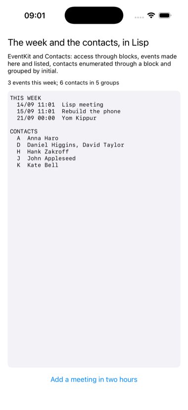

# agenda

The calendar and the contacts, from Lisp.



EventKit and Contacts are the two frameworks every ordinary app touches
and no example had. Both are permission gated, and access is asked for
through a completion block, a Lisp closure called on a thread of the
framework's choosing. EventKit answers a week's query with an array;
Contacts enumerates through a block called once per contact with a stop
flag to write through. What Lisp adds is the ordinary part: dates from
universal time, events made and saved, contacts grouped by initial.

```lisp
(asdf:make "agenda")
(ios-app:run-in-simulator "agenda")
```

On the simulator the prompts are avoided with
`xcrun simctl privacy booted grant calendar org.asdf-ios-app.agenda` and
the same for `contacts`; `AGENDA_SEED=1` in the environment adds two
events first, which is how the picture was taken.
