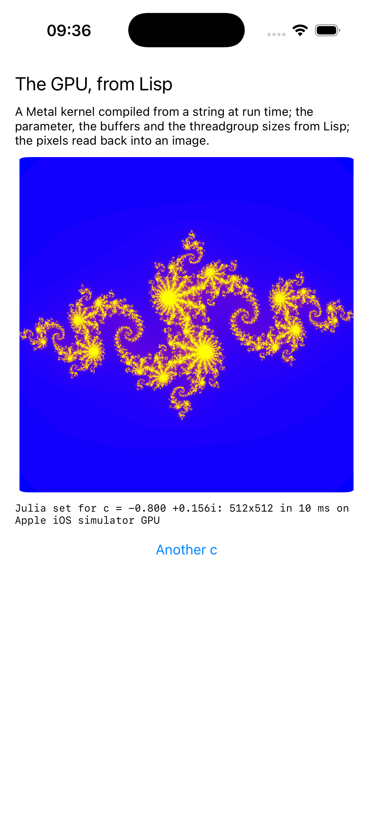

# compute

Metal on iOS: a compute kernel written and dispatched from Lisp.



The kernel is a string in `compute.lisp`, compiled by the device at run
time; no shader file in the bundle. Lisp picks the Julia set's parameter,
writes it into a buffer, dispatches the threadgroups, waits, and reads
the pixels back out of the output buffer to make an image. `MTLSize`, the
structure of three integers that sizes the grid and the threadgroup, goes
over by value as a vector. The macOS example draws with Metal; this
computes with it, and the simulator's Metal is real.

```lisp
(asdf:make "compute")
(ios-app:run-in-simulator "compute")
```
