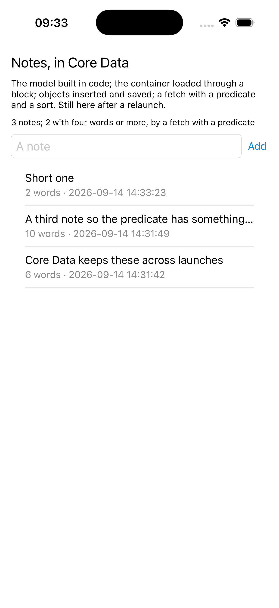

# coredata

Notes kept in Core Data, with the model built in code from Lisp.



The ledger example drove SQLite by hand; this is Apple's layer over it.
Everything Xcode would put in a `.xcdatamodeld`, an entity and its
attributes, is built in code at launch. `NSPersistentContainer` opens the
store through a completion block; objects are inserted, given values by
key, and saved; a fetch request carries a predicate and a sort. The
predicate is made with `predicateWithFormat:argumentArray:` rather than
the variadic form, which is the one thing not to call through the bridge.

```lisp
(asdf:make "coredata")
(ios-app:run-in-simulator "coredata")
```

`COREDATA_ADD=text` in the environment adds a note at launch, which is
how the picture was taken across a few launches.
