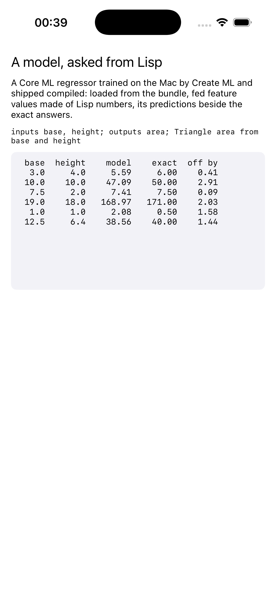

# coreml

A Core ML model, trained on the Mac, run from Lisp on the phone.



The model is a boosted-tree regressor that `build.sh` trains with Create
ML, on the Mac, to give the area of a triangle from its base and height,
and compiles with `coremlc` into the `.mlmodelc` the app ships as a
resource. It is small on purpose, because the model is not the point. The
point is the round trip: the compiled model loaded from the bundle,
inputs handed over as a feature provider built from Lisp numbers, the
prediction read back as a feature value, and the exact answer computed
beside it in Lisp so the error is visible. Everything a real model needs,
with a toy inside.

```lisp
(asdf:make "coreml")
(ios-app:run-in-simulator "coreml")
```

Needs Xcode: Create ML and `coremlc` are its.
