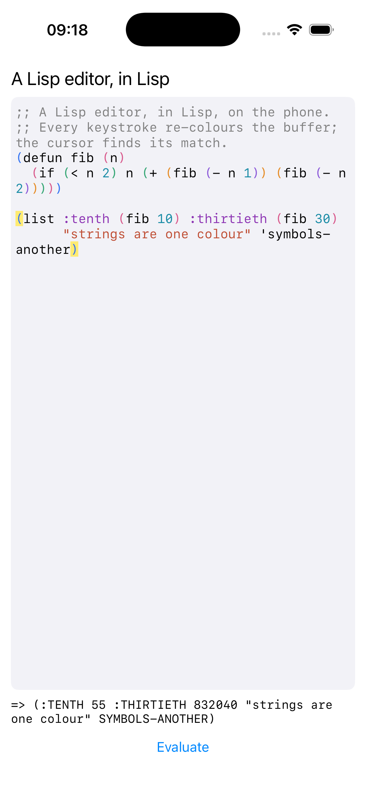

# editor

A Lisp editor, in Lisp, on the phone.



TextKit does the text; Lisp does the rest. On every keystroke the
`UITextViewDelegate`, a Lisp class, tokenizes the buffer and colours it
through the text storage: parentheses by depth, strings, comments,
keywords, numbers. On every cursor move it finds the matching parenthesis
and marks the pair. Evaluate reads the buffer and evaluates it in the
image running the editor, so the function you define is the one that runs.

```lisp
(asdf:make "editor")
(ios-app:run-in-simulator "editor")
```
