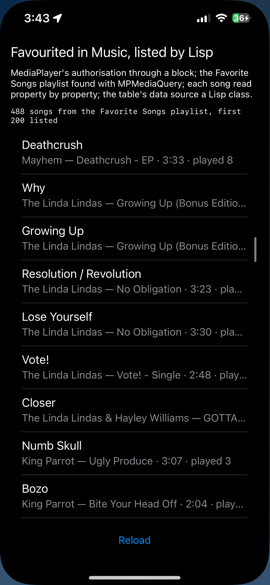

# favourites

The songs favourited in Music, listed by Lisp.



MediaPlayer reads the phone's music library, and `MPMediaQuery` is its
question. Since iOS 17.2 a song favourited in Music lands in a playlist the
system keeps called Favorite Songs, so the favourites are that playlist's
items: found by name among the library's playlists, then read out a property
at a time through `valueForProperty:`, which is how `MPMediaItem` answers for
everything. Access is asked for first through `MPMediaLibrary`'s block, which
arrives on a thread of the framework's and is bounced to the main thread
before it touches the table. Where there is no such playlist the songs rated
four stars or more stand in, and failing those the most played.

```lisp
(asdf:make "favourites")
(ios-app:install-on-device (ios-app::bundle-root-for (asdf:find-system "favourites") (ios-app::find-platform :device)))
```

A simulator has no music library and says so; this one is for the phone,
built with the signing environment set. What it prints is in the app's kept
console, `Documents/console.log`, which `ios-app:device-console-log` reads
back over the cable.
