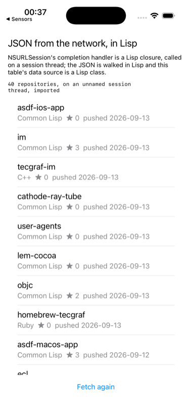

# fetch

JSON over the network, decoded in Lisp, shown in a table.



NSURLSession does the fetching; everything around it is Lisp. The
completion handler is a block made from a lambda, and the session calls
it on a thread of its own, one ECL never made and the runtime imports.
The JSON is parsed by Foundation and walked in Lisp, the result is handed
to the main thread with `ios-app-runtime:on-main`, and the table's data
source is a Lisp class. The request is to GitHub's public API for the
repositories these tools live in.

```lisp
(asdf:make "fetch")
(ios-app:run-in-simulator "fetch")
```

Needs the network. A failure, offline or rate limited, is shown in the
status line rather than crashing the app.
