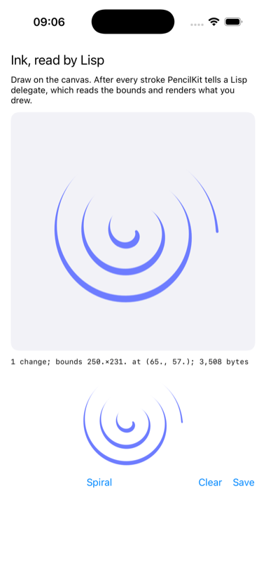

# ink

A PencilKit canvas whose every stroke reaches a Lisp delegate.



`PKCanvasView` takes the finger or the pencil and tells its delegate after
every stroke. The delegate is a Lisp class, and it does what PencilKit's
Objective-C surface allows: reads the drawing's bounds, renders it to an
image at 2x, and keeps its bytes in Documents. The strokes themselves are
Swift-only structures, so the spiral the app opens with was composed on
the Mac by `build.sh`, with the Mac's own PencilKit, and shipped through
`:bundle-resources`.

```lisp
(asdf:make "ink")
(ios-app:run-in-simulator "ink")
```

Draw with the mouse; the caption and the preview follow each stroke.
