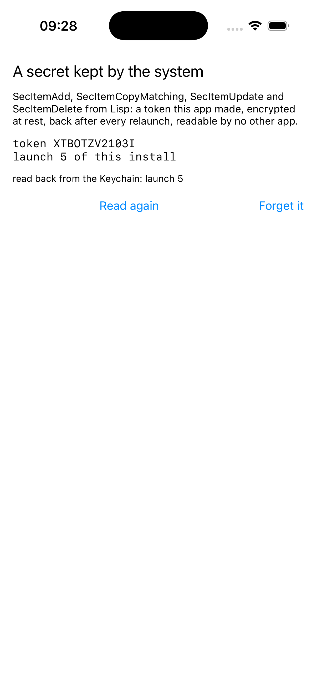

# keychain

A secret kept by the system, through the Security framework's C API.



The API is four C functions that take a dictionary: `SecItemAdd`,
`SecItemCopyMatching`, `SecItemUpdate`, `SecItemDelete`. The dictionary's
keys are exported `CFStringRef` constants read out of their symbols by
name, and the dictionary is an `NSMutableDictionary`, since CFDictionary
and NSDictionary are one object. The item is a generic password: a token
this app made on its first launch, with a launch count kept inside it,
encrypted at rest, back after every relaunch, and readable by no other
app. The one persistence example with no prompt and real security.

```lisp
(asdf:make "keychain")
(ios-app:run-in-simulator "keychain")
```

Launch it three times and the count says so.

It works on the simulator because asdf-ios-app links every simulator build's
entitlements into the binary as a `__TEXT,__entitlements` section, the way
Xcode does: the simulator's `securityd` reads the `application-identifier`
and `keychain-access-groups` there, and without them every one of these
calls answers `errSecMissingEntitlement`, -34018. Nothing in this example
asks for it; `:entitlements :ios-default` does.
