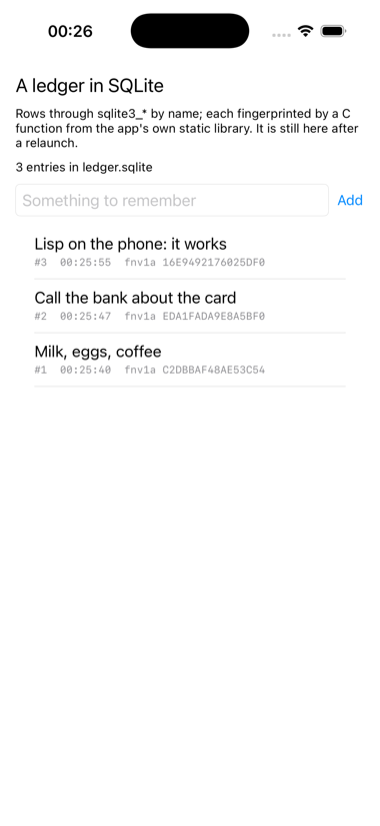

# ledger

A ledger kept in SQLite, each entry fingerprinted by a C function from a
static library of the app's own.



Two things no other example links. SQLite ships with iOS and one linker
flag brings it in; `fingerprint.c` is compiled by `build.sh` into
`libfingerprint.a` for each platform and named in
`:bundle-static-libraries`, with `~a` standing for the platform as it
does for embedded frameworks. Both are reached the same way, a C function
looked up by name and called through the dynamic FFI, and the ledger
survives across launches in the app's Documents directory.

```lisp
:bundle-link-flags ("-lsqlite3")
:bundle-static-libraries ("build/~a/libfingerprint.a")
```

The SQLite calls are the classic five, open, prepare, step, column and
finalize, with text bound as a parameter rather than spliced into SQL.
The table's data source is a Lisp class, as in `examples/browser`.

```lisp
(asdf:make "ledger")
(ios-app:run-in-simulator "ledger")
```

`LEDGER_ADD=text` in the environment adds an entry at launch, which is
how the picture was taken across a few launches.
