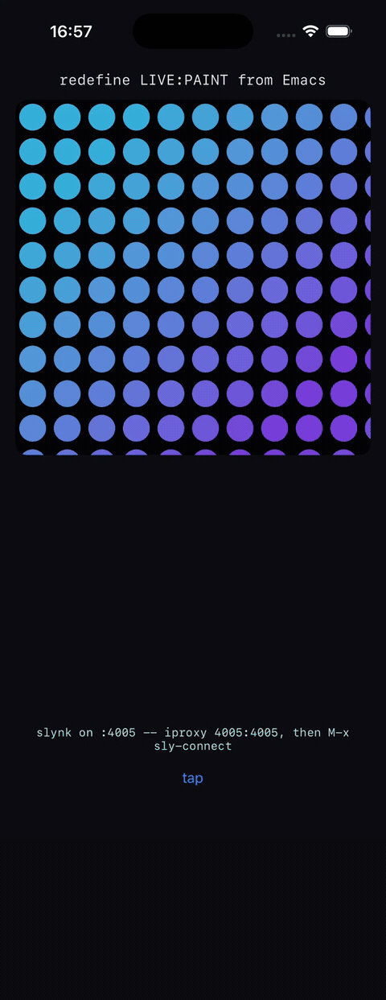

# live — programming the phone from Emacs

The app is a caption, a canvas and a button. Each is one Lisp function, and
the point of the app is to replace them while it runs on an iPhone in your
hand, from a SLY REPL in Emacs, over the USB cable. Nothing is rebuilt.

`live.lisp` is the app. `tour.lisp` is the demonstration: ten steps to send
from Emacs, one form at a time. `iphone.el` is one command that starts the
forwarder and connects. `lem-iphone.lisp` is the same for
[Lem](https://github.com/lem-project/lem): load it, `M-x iphone-connect`,
and `C-c C-p` sends the form at point to the phone. Its slynk client is
forty lines, since the protocol is a length and an s-expression.

<p align="center">
  <a href="../../doc/videos/live-tour.mp4"></a>
</p>

The whole tour, with the form being sent captioned under the screen. This
recording is the simulator build -- the same app, the same forms, the same
slynk -- because a phone's screen can only be recorded through QuickTime and
this was made from a shell. [`live-tour.mp4`](../../doc/videos/live-tour.mp4)
is the same thing at full rate.

## What you need

- A phone with Developer Mode on, plugged in and unlocked, and the signing
  environment described in the top-level README: `IOS_SIGNING_IDENTITY`,
  `IOS_DEVELOPMENT_TEAM`, `IOS_PROVISIONING_PROFILE`.
- sly's `slynk/` directory on your source registry, since slynk is not on
  Quicklisp under that name. The app's slynk and your Emacs's SLY should be
  the same checkout, or at least the same era.
- `brew install libimobiledevice`, for `iproxy`.
- The cable. Xcode and `devicectl` reach a paired phone over Wi-Fi, so an
  unplugged phone still installs and launches apps -- but `iproxy` forwards
  only to a phone usbmuxd can see, and a Wi-Fi-only phone answers a
  connection with a reset and no explanation. `idevice_id -l` lists what is on
  the cable; empty means plug it in.

## Build, install, connect

```lisp
(asdf:make "live")                                   ; both platforms, signed
(ios-app:install-on-device "examples/live/build/iphoneos/Live.app")
```

Tap the icon. The bottom line of the screen reads

    slynk on :4005 -- iproxy 4005 4005, then M-x sly-connect

which is the whole recipe. In Emacs:

```
M-x load-file RET examples/live/iphone.el RET
M-x sly-iphone RET
```

or by hand, `iproxy 4005:4005` in a terminal and `M-x sly-connect RET
localhost RET 4005 RET`. The moment SLY connects the bottom line changes to
"Emacs is connected". The REPL prompt is `CL-USER>`, and it is the phone's.

Then open `tour.lisp`, and send each form with `C-c C-c`.

## From Lem

```
M-x load-file RET examples/live/lem-iphone.lisp RET
M-x iphone-connect          ; iproxy for a phone on the cable, else localhost
C-c C-p                     ; the top-level form around point
M-x iphone-eval-region
M-x iphone-eval             ; a form at a prompt
```

Forms are read on the phone in the `LIVE` package, so the tour works from
Lem too. Measured with Lem on its Cocoa frontend against the simulator
build: `(live:say ...)` and a redefinition of `caption-text` both showed on
the simulator's screen. A phone on the cable takes the same path
`iphone.el` does.

## What the tour shows

1. `say` — a string from Emacs on the screen.
2. `caption-text` redefined — the label now names the device.
3. `paint` redefined — the canvas draws something else on the next `redraw`.
4. A `paint` that signals — caught before UIKit sees it, reported on screen,
   and the next fix draws again. The app does not die for a typo.
5. `on-tap` redefined, with state — the button on the phone now runs code that
   was written after the app was built.
6. An `NSTimer` made from the REPL — animation, and how to stop it.
7. A `UISlider` that did not exist when the app was built, wired to a closure.
8. `(room)`, the threads, the device's name — it is a whole Lisp.
9. The view hierarchy, walked with `objc:invoke`.
10. Tidying up.

## The three things that make it work

**Everything exported goes to the main thread itself.** SLY evaluates on a
slynk worker and UIKit is main-thread only, so `say`, `redraw` and `add-view`
each wrap themselves in `live:main`, which is `ios-app-runtime:with-main-thread`.
Anything else that touches a view — the timer in step 6, the slider in
step 7 — is sent inside `(main ...)` explicitly. Forgetting it is not slow or
flaky, it is undefined, and it usually looks like it worked.

**The three functions are `notinline`.** ECL compiles a call to a function in
the same file as a direct C call. Without the declamation, a `defun` from
Emacs would replace the `fdefinition` and `drawRect:` would keep calling the
version compiled on the Mac, silently. Anything you intend to redefine at run
time, and that its own file calls, wants a `(declaim (notinline ...))`.

**`:remote-repl t` in the `.asd`, on a device.** slynk is started by the
runtime before the entry point, on the phone's loopback interface, so an
entry point that signals is still reachable. Loopback only: this is an
unauthenticated eval server, and the cable is the security model. Do not
widen `:interface` to a network, and do not ship a build with it on.

## Measured

On an iPhone 16e, iOS 26.6.1, over the cable: the full tour -- all ten steps,
including the deliberate error, the timer and the slider -- was run form by
form through `iproxy` against this app on the phone, and the app was still
running afterwards. The same tour runs against the simulator build, where the
app listens on the Mac's own loopback and no forwarder is needed; the
screenshot in the top-level README is that build, before the first form.

One thing to know when both are running: the simulator's copy listens on the
Mac's own port 4005, so `iproxy` cannot bind it and a client that thinks it
is talking to the phone is talking to the simulator. Step 8 tells them apart
-- a device answers `"iPhone"`, the simulator its model name -- and so does
`lsof -iTCP:4005`. Quit one before connecting to the other.
