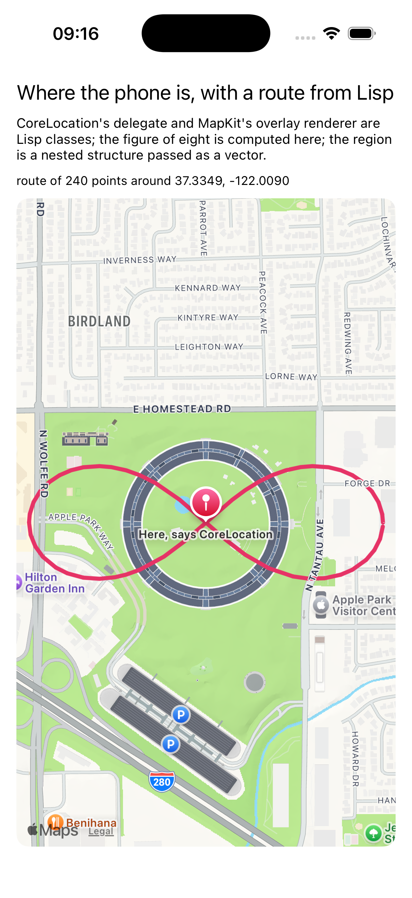

# map

A map centred where the phone is, with a route computed in Lisp drawn
over it.



CoreLocation delivers the position to a delegate, and MapKit asks its
delegate how to draw each overlay; both delegates are the same Lisp
class. The route is Lisp's, a lemniscate walked around the location and
written into a C array for `MKPolyline`. The region the map is told to
show is `MKCoordinateRegion`, a structure of two structures, and it goes
over as a vector of two vectors: the objc bridge writes any declared
structure from a sequence, nested ones included, which this example was
the first to lean on.

```lisp
(asdf:make "map")
(ios-app:run-in-simulator "map")
```

On the simulator: `xcrun simctl privacy booted grant location
org.asdf-ios-app.map`, then `xcrun simctl location booted set
37.3349,-122.0090` to put the phone somewhere; the route follows.
