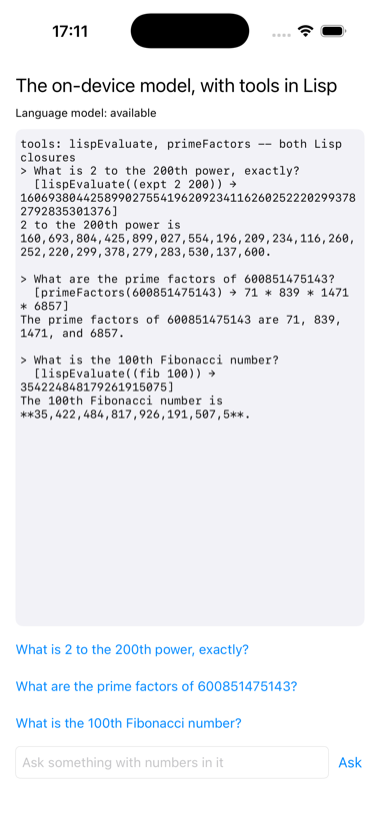

# model

The on-device language model of iOS 26, with its tools written in Lisp.



FoundationModels is Swift only, so `LispModel.swift` wraps two things in
`@objc`: registering a tool whose implementation is a closure, and asking
the model a question with the registered tools in hand. On the Lisp side a
tool is `objc:make-objc-block` over a lambda, and the model's own thread
arrives in it.

The model is told it cannot do arithmetic and must call Lisp for any
calculation. Two tools: `lispEvaluate`, which reads one arithmetic
expression under a whitelist and evaluates it exactly, and `primeFactors`.
So "what is 2 to the 200th power, exactly?" becomes `(expt 2 200)` in this
image, and the model reads the sixty-one digits back. The transcript shows
each tool call as it was made, with the exact result on the tool's line;
the model's own sentence sometimes regroups those digits with commas
wrongly, which is the model, and is why the tool line is there.

Three things were measured while making this, and shaped it. A small model
drops the outer parentheses now and then, so the evaluator wraps a bare
`factorial 100`; it occasionally writes `100!` or `10 ^ 150`, and those two
spellings are translated; and handed two huge numbers it compares them
wrongly, so the questions each have one exact answer. A generation that
fails outright is retried in a fresh session, and a tool that is called
eight times for one question refuses, which ends a loop the model can
otherwise fall into. `MODEL_ASK=all` in the environment asks all three
questions in turn, which is how the picture above was taken.

```lisp
(asdf:make "model")
(ios-app:run-in-simulator "model")
```

Needs a simulator or device where the model reports itself available: an
iOS 26 runtime with Apple Intelligence on.
