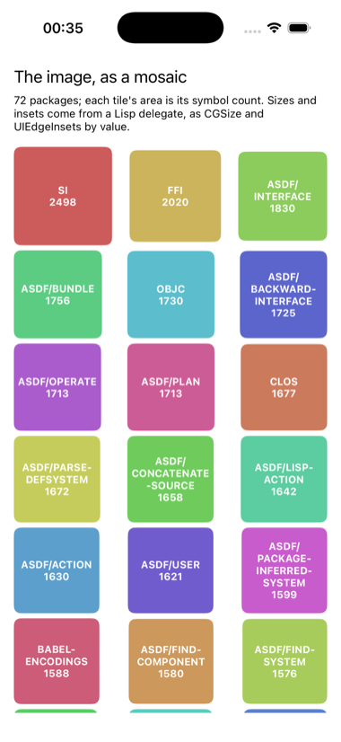

# mosaic

The packages of the running image as a mosaic, laid out by a Lisp
delegate that returns structures by value.



`UICollectionViewDelegateFlowLayout` asks its delegate for a `CGSize` per
item and a `UIEdgeInsets` per section, both returned by value. A Lisp
method returning a structure is the hardest thing the bridge does in the
inbound direction, and here it does it for every tile, on the phone,
through a libffi closure, with no C compiler anywhere. `UIEdgeInsets` is
declared with `objc:define-objc-struct`; `CGSize` is `cocoa:ns-size`. The
two are returned differently, and the difference is worth knowing: a
Cocoa structure comes back as a vector, while a structure you declared
comes back as a pointer to its bytes in foreign memory, which is what the
LispWorks manual's own example does.

The same Lisp class is the data source. Each tile's area is proportional
to the package's symbol count, so the mosaic is a picture of the image
looking at itself.

```lisp
(asdf:make "mosaic")
(ios-app:run-in-simulator "mosaic")
```
