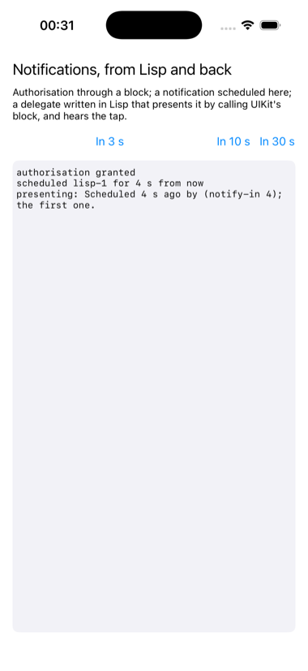

# notify

A local notification scheduled by Lisp, presented by a delegate written
in Lisp, and heard by it when tapped.



UNUserNotificationCenter in three parts, each a different shape of bridge
traffic. Authorisation is requested with a completion block, a Lisp
closure called with a BOOL and an error. A notification is built from
content and a trigger and handed over. And the centre's delegate is a
Lisp class: asked how to present a notification that arrives while the
app is in front, it answers by calling the block UIKit passed it, a block
Cocoa made and Lisp calls, and it hears the tap when one is opened.

Authorisation is provisional, so there is no prompt and a simulator run
needs no finger; the price is that the notification is delivered quietly,
to Notification Center and not as a banner, whatever the delegate asks
for. The delegate's own line in the log, "presenting", is the proof it
ran. A real app would ask for the full kind, and get the banner.

One thing found the hard way: the delegate class must *declare* the
protocol, `(:objc-protocols "UNUserNotificationCenterDelegate")`, not
only implement its methods. The centre asks whether its delegate conforms,
and a class that merely has the methods is never asked to present.

```lisp
(asdf:make "notify")
(ios-app:run-in-simulator "notify")
```

`NOTIFY_AT_LAUNCH=3` in the environment schedules one three seconds in,
which is how the picture was taken.
