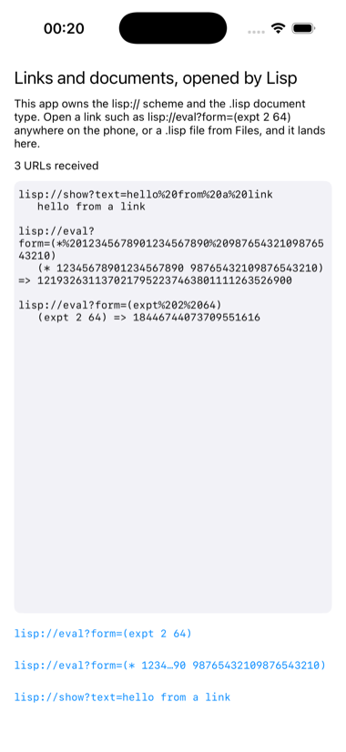

# opener

An app that owns a URL scheme and a document type, with every URL handed
to Lisp.



Two declarations in `opener.asd`, used by no other example:
`:bundle-url-schemes ("lisp")` makes `lisp://...` links anywhere on the
phone open this app, and `:bundle-document-types` with an exported type
declaration makes `.lisp` files in Files and share sheets offer it. The
delegate, `OpenerDelegate.m`, is scene based like `examples/scene` and
adds the two URL entry points: a URL that launched the app, and one that
arrived while it was running. A document's contents are read on the
Objective-C side, where the security scope lives, and cross to Lisp with
the path.

What a link may ask for is deliberately small: `lisp://eval?form=...` is
evaluated under a whitelist of arithmetic, and `lisp://show?text=...` is
shown. A URL is untrusted input.

```lisp
(asdf:make "opener")
(ios-app:run-in-simulator "opener")
```

Then, from the Mac:

```
xcrun simctl openurl booted 'lisp://eval?form=(expt%202%2064)'
xcrun simctl openurl booted 'lisp://show?text=hello%20from%20Safari'
```
