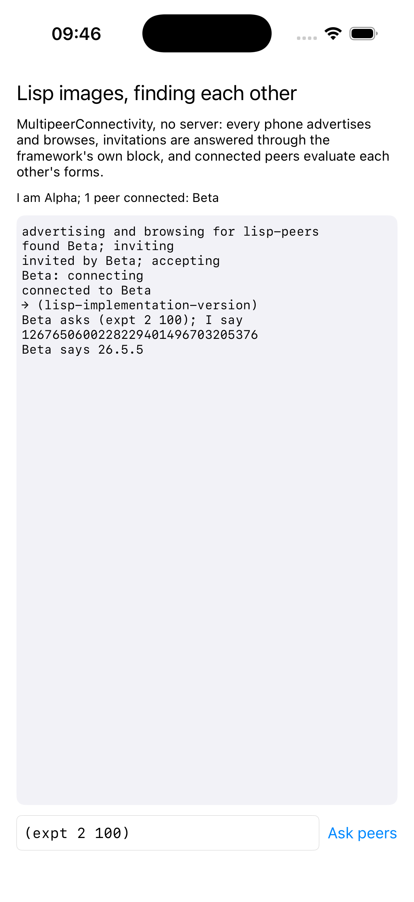

# peers

Two Lisp images finding each other and evaluating each other's forms, with
no server.



MultipeerConnectivity connects nearby devices over Wi-Fi and Bluetooth.
Each phone here both advertises and browses for the same service type; a
browser that finds a peer invites it, and an advertiser that is invited
accepts by calling the block the framework handed its delegate, a block
Cocoa made and Lisp calls. The session then carries bytes both ways, and
the bytes are Lisp forms: what one phone sends, the other evaluates under
a small whitelist and answers. Every delegate is a Lisp class, and every
callback arrives on the framework's queue.

```lisp
(asdf:make "peers")
(ios-app:run-in-simulator "peers")
```

Two simulators on one Mac find each other. `PEERS_NAME` names a phone
and `PEERS_SEND` is a form sent on connection, which is how the pictures
were taken, one per simulator.
