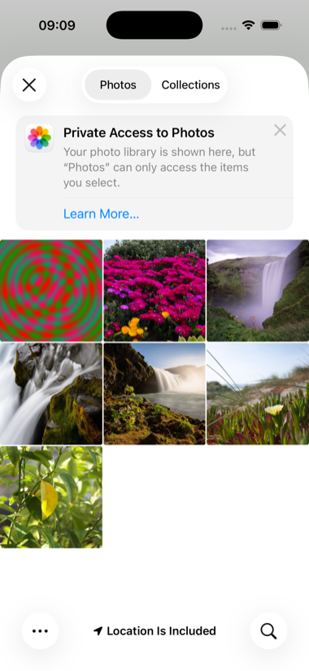

# photos

The photo library, read and written from Lisp.



PhotoKit has two doors, and both are Lisp closures here.
`PHPickerViewController` opens the library in a system sheet and needs no
permission: the user picks, and only the picks reach the app, each
through an item provider's completion block, to a delegate that is a Lisp
class. Adding needs add-only permission, asked for through a block, and
the addition is a block PhotoKit runs inside a transaction. The picture
that gets added is drawn in Lisp pixel by pixel into a byte array that
becomes a `CGImage`; no drawing API, just numbers.

Why the picker and not a fetch of every asset: on iOS 26, full library
access cannot be granted from the command line. `simctl privacy grant
photos` writes the TCC row and PhotoKit prompts anyway, while add-only is
honoured and the picker needs nothing, so this is the shape a test can
drive.

```lisp
(asdf:make "photos")
(ios-app:run-in-simulator "photos")
```

On the simulator, `xcrun simctl privacy booted grant photos-add
org.asdf-ios-app.photos` avoids the add prompt; `PHOTOS_ADD=1` in the
environment adds the picture at launch and `PHOTOS_PICK=1` opens the
picker, which is how the picture was taken.
