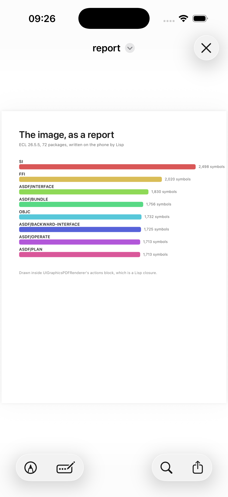

# report

A PDF written by Lisp, previewed with Quick Look, offered by the share
sheet.



`UIGraphicsPDFRenderer` runs a block per document, and inside it the
ordinary drawing API works: strings draw themselves with attributes,
paths fill. The block is a Lisp closure and the data is the image's own
packages, so the report is Lisp's in every sense. `QLPreviewController`
then shows the file through a data source that is a Lisp class, and
`UIActivityViewController` offers it to whatever the phone has.

```lisp
(asdf:make "report")
(ios-app:run-in-simulator "report")
```

`REPORT_SHOW=preview` or `REPORT_SHOW=share` in the environment opens that
at launch, which is how the picture was taken.
