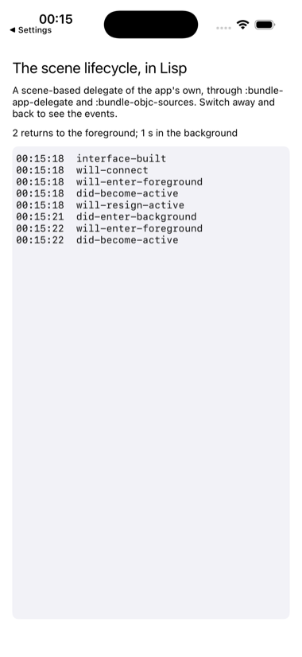

# scene

An application delegate of the app's own, using UIScene, with every
lifecycle event reported to Lisp. And an icon.



The delegate asdf-ios-app ships is scene based, and `SceneAppDelegate.m` is
what an app does when it wants the lifecycle for itself: the same pair, the
application delegate only naming the scene delegate and the scene delegate
making the window and booting the image, but this one also calls
`scene-ios:lifecycle` for each event, which the shipped one does not.
Three options in `scene.asd` make that happen, none used by any other
example:

```lisp
:bundle-app-delegate "SceneAppDelegate"       ; replaces ECLAppDelegate
:bundle-objc-sources ("SceneAppDelegate.m")   ; compiled after the shim
:bundle-info-plist (("UIApplicationSceneManifest" . ...))  ; how UIKit finds the scene delegate
:bundle-icon "Icon.xcassets"                  ; compiled by actool
```

The Lisp keeps the log, counts returns to the foreground and seconds
spent away, and shows both, which is what a real app does with these
events: pause, save, and on return, refresh.

```lisp
(asdf:make "scene")
(ios-app:run-in-simulator "scene")
```

Switch to another app and back to see the events arrive.
