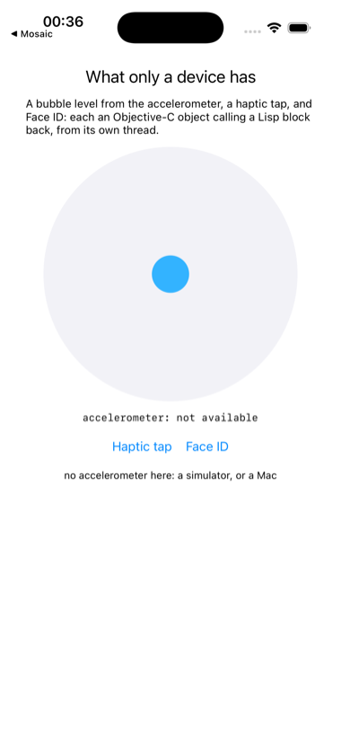

# sensors

Three things a simulator cannot do: a bubble level from the accelerometer,
a haptic tap, and Face ID.



Each is reached the same way: an Objective-C object asked to start, with a
block made from a Lisp lambda for it to call back through. CoreMotion
calls on an operation queue of its own, thirty times a second here, with
a `CMAcceleration` returned by value; LocalAuthentication replies once,
on a thread of its choosing; the feedback generator needs no reply at
all. Everything that touches the screen is handed to the main thread.

The system is declared for both platforms, and a device build takes its
signing from `IOS_SIGNING_IDENTITY`, `IOS_DEVELOPMENT_TEAM` and
`IOS_PROVISIONING_PROFILE` in the environment, as the attractor examples
do. On the simulator the accelerometer reports itself absent, the haptic
does nothing, and Face ID is available only if enrolled from the
simulator's Features menu; that is enough to see the interface and run the
three code paths, and the picture above is from there. The device is
where it means something, and no CI can reach one.

```lisp
(asdf:make "sensors")
(ios-app:run-in-simulator "sensors")
(ios-app:install-on-device "sensors")
```
