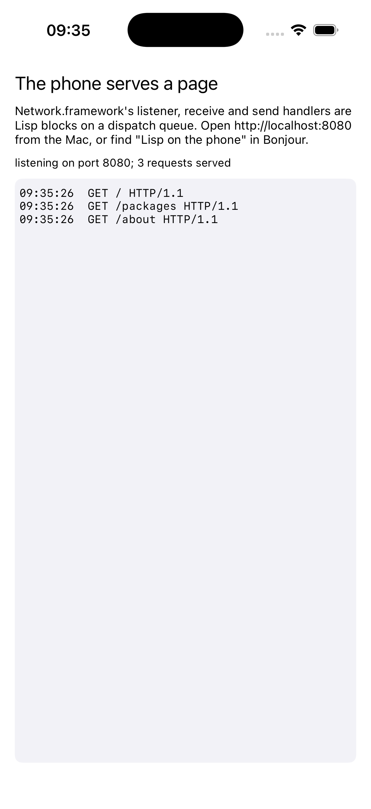

# serve

The phone serves a web page from Lisp, on Network.framework, and says so
over Bonjour.



Network.framework is Apple's socket layer: C functions whose every event
is a block on a dispatch queue. The listener's new-connection handler,
each connection's receive handler and its send completion are Lisp
closures here, arriving on the queue's own thread, and `dispatch_data`
goes in and out through mapped copies. The page is about the image
serving it. The listener is advertised as `_http._tcp`, so browsers on
the network find "Lisp on the phone" by name.

```lisp
(asdf:make "serve")
(ios-app:run-in-simulator "serve")
```

The simulator shares the Mac's network, so from the Mac:

```
curl http://localhost:8080/
dns-sd -B _http._tcp
```
