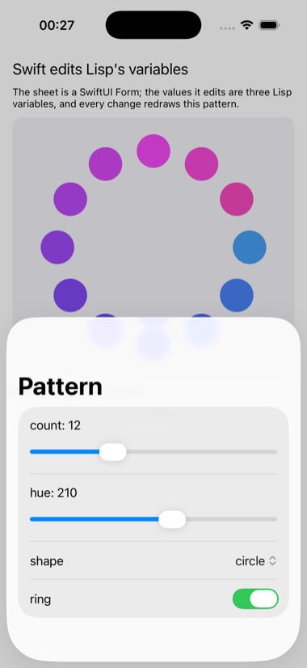

# settings

A SwiftUI settings sheet whose values are Lisp variables.



The other Swift examples run one way: Lisp builds the interface and Swift
reports results back. This one runs the other way. `LispSettings.swift`
builds a Form of sliders, toggles and pickers from one string per setting,
takes each control's current value from Lisp, and calls one block, made
from a Lisp lambda, on every change. The Lisp side keeps the variables,
and redraws the pattern beneath from them: how many marks, what hue,
circles or squares, ring or grid.

```lisp
(asdf:make "settings")
(ios-app:run-in-simulator "settings")
```

Tap Settings… and move a slider; the pattern follows. `SETTINGS_SHEET=1`
in the environment opens the sheet at launch, which is how the picture was
taken.
