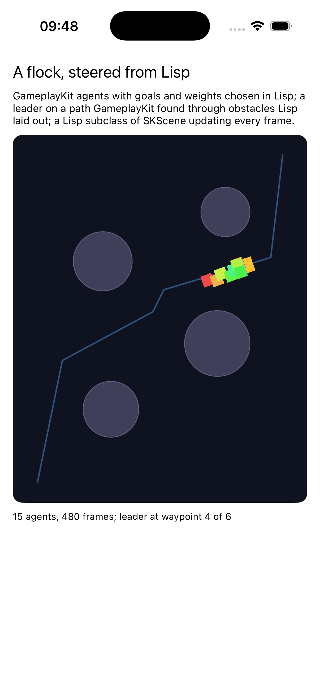

# sprites

A game engine, steered from Lisp: SpriteKit draws, GameplayKit decides,
and the decisions are Lisp's.



The scene is a Lisp subclass of `SKScene` whose `update:` runs every
frame on SpriteKit's schedule and moves each sprite to where its agent
went. The agents are `GKAgent2D`s with behaviours built from
GameplayKit's goals, cohere, separate, align, intercept and wander, at
weights Lisp chose. The leader follows a path `GKObstacleGraph` found
around obstacles Lisp laid out. `vector_float2`, GameplayKit's two-float
SIMD type, is one Objective-C cannot describe: Clang encodes it as
nothing, so the runtime's signature for `setPosition:` has no argument
at all. objc notices the hole and asks to be told; the example declares
the three signatures once with `declare-objc-signature`, and from then
on a `vector_float2` goes in and comes out as a Lisp vector.

```lisp
(asdf:make "sprites")
(ios-app:run-in-simulator "sprites")
```
