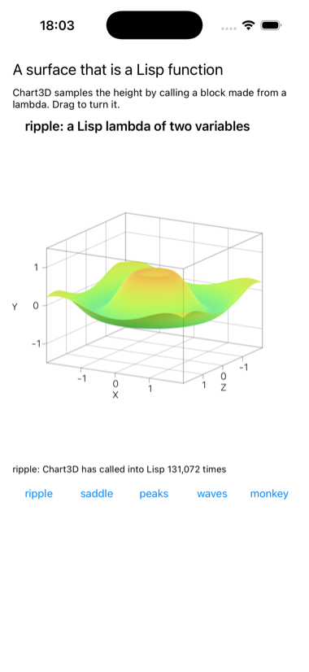
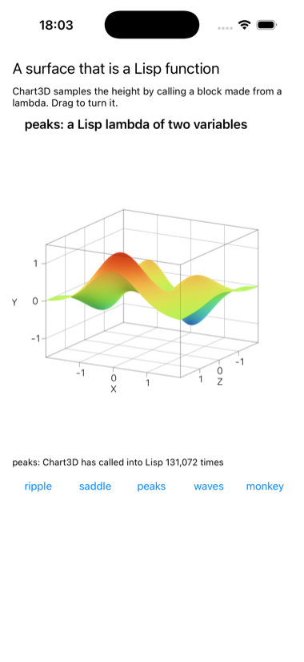
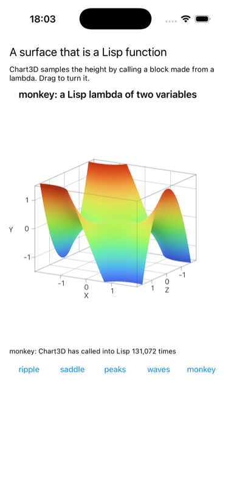

# surface

A 3D surface plot, where the surface is a Lisp function.



Chart3D, new in iOS 26's Swift Charts, draws z = f(x, y) as a lit,
rotatable surface and asks for nothing but f. It is Swift only, SwiftUI
all the way down. `LispSurface.swift` takes f as a block; on the Lisp side
that block is `objc:make-objc-block` over a lambda, and Chart3D calls it
for every vertex of the mesh, a few thousand round trips from SwiftUI into
the image per surface, on whatever thread SwiftUI samples on. The caption
counts them as they happen.

The buttons are not choosing between surfaces Swift knows about. Each hands
Chart3D a different lambda from `*surfaces*` in `surface.lisp`, which is
the part worth editing: add a `(cons "name" (lambda (x y) ...))` and it
gets a button. Drag the chart to turn it.

```lisp
(asdf:make "surface")
(ios-app:run-in-simulator "surface")
```

<p>


</p>

Needs Xcode's `swiftc` once, to build the framework; the app build runs
`build.sh` itself. `SURFACE_SHOW=peaks` in the environment picks the first
surface shown, which is how the pictures were taken.
