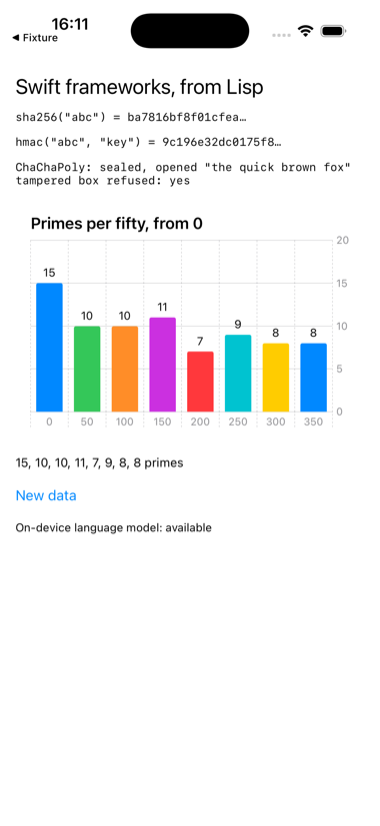

# swift

CryptoKit, Swift Charts in SwiftUI, and FoundationModels, from Lisp on iOS.



None of the three has an Objective-C surface: ask the runtime for their
classes and there are none. `LispSwift.swift` gives each a few `@objc`
methods that take and return what Objective-C can carry, `build.sh` builds
that into `LispSwift.framework` for the simulator and for the device, and
`swift.asd` embeds the one for the platform being built:

```lisp
:bundle-embedded-frameworks ("build/~a/LispSwift.framework")
```

The framework goes into the bundle's `Frameworks/`, the app is linked with
an rpath that finds it there, and it is signed before the app is. After that
the Lisp is `objc:invoke` on classes that happen to be Swift: a hash, an HMAC,
a sealed box opened and a tampered one refused, a bar chart of primes counted
in Lisp hosted as a child view controller, and the on-device model's
availability, which on a simulator is "unavailable".

```lisp
(asdf:make "swift")
(ios-app:run-in-simulator "swift")
```

Needs Xcode's `swiftc` once, to build the framework; the app build runs
`build.sh` itself and skips it while the framework is newer than the Swift.
