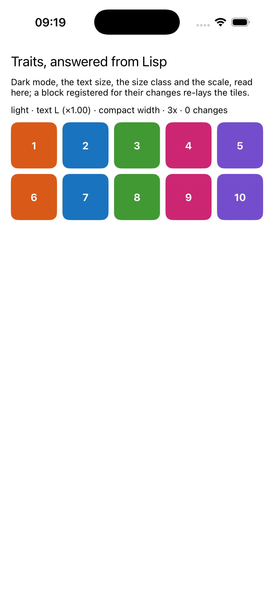
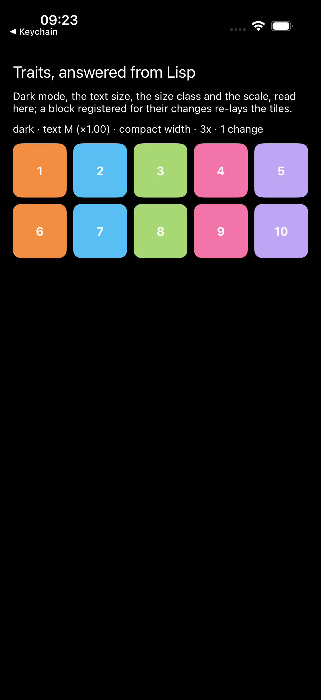
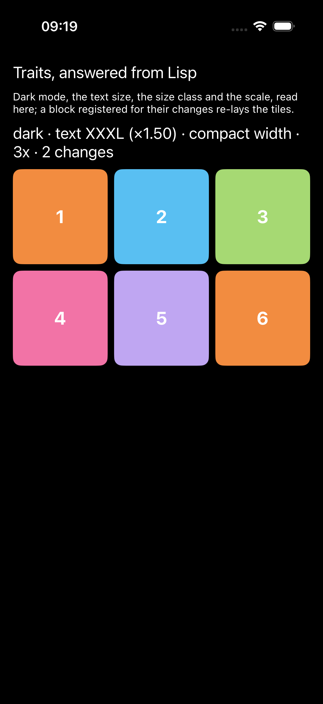

# traits

Dark mode, Dynamic Type, the size class and the scale, answered from
Lisp.

<p>



</p>

The trait collection carries what the system decided about an app's
surroundings, and since iOS 17 a view can register a block for changes to
the traits it cares about, no subclass needed. The block is a Lisp
closure, and everything on screen follows from the traits Lisp reads: the
palette per appearance, the type size, the number of columns.

```lisp
(asdf:make "traits")
(ios-app:run-in-simulator "traits")
```

The simulator flips them from the command line, which is how the
pictures were taken:

```
xcrun simctl ui booted appearance dark
xcrun simctl ui booted content_size extra-extra-extra-large
```
